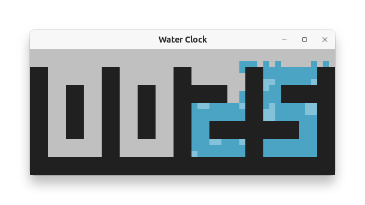

Waterclock
==========

デジタルの水時計。



時計の数字の形の入れ物に水滴が落下・移動する様子がシミュレーションされます。  

オンライン版もあります → https://www.toshihirokamiya.com/waterclock/

## インストール

```sh
pipx install git+https://github.com/tos-kamiya/waterclock
```

または、

```sh
git clone https://github.com/tos-kamiya/waterclock
cd waterclock
pip install .
```

