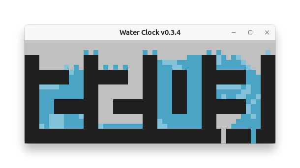

→ English [→ 日本語🇯🇵](README-ja_JP.md)

# Water Clock

A digital water clock.



This project simulates water droplets falling and moving inside containers shaped like digital clock digits.

An online version is also available → [https://www.toshihirokamiya.com/waterclock/](https://www.toshihirokamiya.com/waterclock/)

## Installation

Using pipx:

```sh
pipx install git+https://github.com/tos-kamiya/waterclock
```

Or, clone and install:

```sh
git clone https://github.com/tos-kamiya/waterclock
cd waterclock
pip install .
```

After installation, launch the clock with the `waterclock` command.
